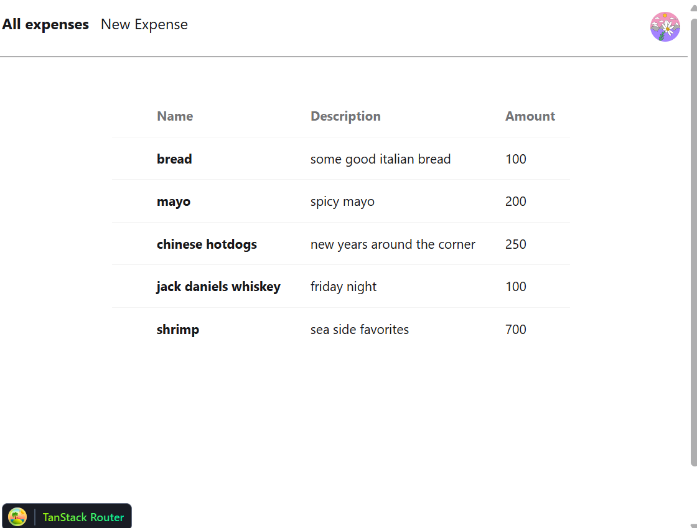
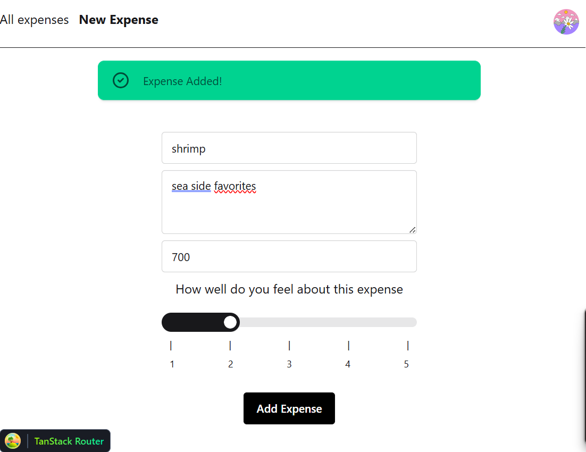

# Expense Tracker

**Tanstack Router, TanStack Query, Drizzle ORM, Zod, Hono, Supabase, TailwindCSS, DaisyUI, react-hook-form, postgres, bun, better-auth**

Experimental PoC containing google authentication, routing, protected routes, conditionally rendered components and form validation

Install bun [Bun](https://bun.sh/)

Install dependencies:

```bash
bun install
```

Make sure to create google OAuth client add add required keys to .env file then

```bash
cd packages/frontend && bun run dev
cd packages/backend && bun run dev

```



